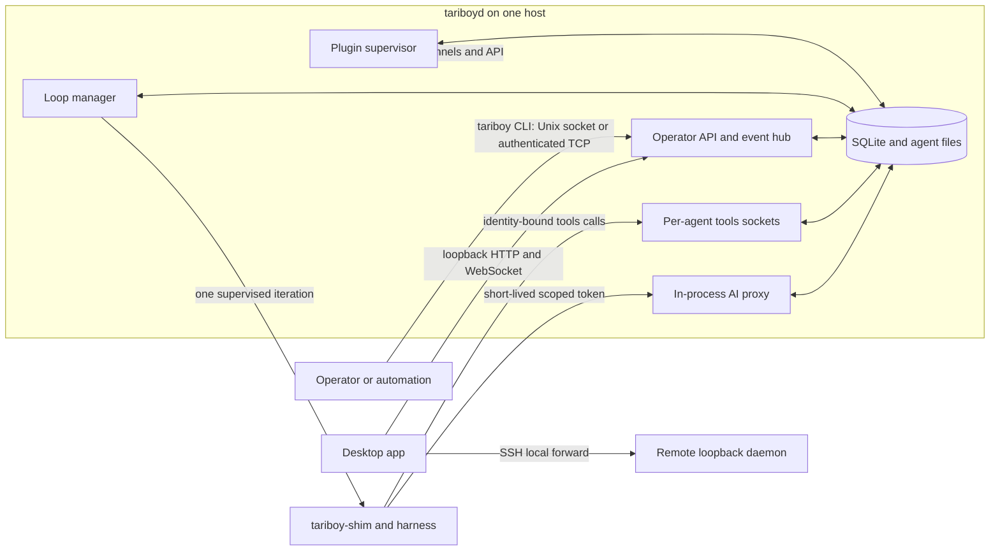
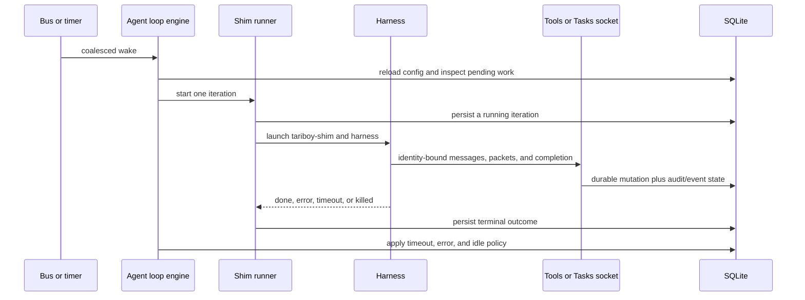
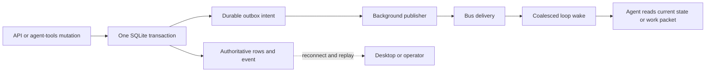

## The daemon (`tariboyd`)

`tariboyd` is the long-running process at the center of the system
(`cmd/tariboyd`, `internal/daemon`). It owns:

- the **agent lifecycle** — create, start/stop the loop, run iterations, reap;
- the **message bus** — channels, subscriptions, deliveries;
- **native Tasks** — queues, recursive task trees, comments, dependencies,
  immutable queue workflow versions, assignment leases, events, and durable
  notification/workflow outboxes;
- the **SQLite store** — `tariboyd.db`, all durable state;
- the **plugin supervisor** — spawns, health-checks, and restarts plugins;
- the **AI proxy** — every LLM call flows through it;
- API and WebSocket surfaces for clients. The Desktop UI is shipped by Tauri,
  not embedded in the daemon.

## System context and trust boundaries

The daemon is the one durable control plane on a host. Desktop and the
operator CLI are clients; harnesses are supervised workers; plugins are
supervised integrations. None of them owns a second copy of product state.



| Surface | Typical client | Boundary and identity |
| --- | --- | --- |
| Operator API | Desktop, CLI, automation | Unix socket by default; a TCP listener requires the configured bearer-token policy. The optional HTTP/WebSocket listener accepts loopback addresses only. |
| Agent tools socket | `tools`, `tasks`, and `i-am-done` within an agent | One Unix socket per agent. The daemon derives the agent and current iteration, so request JSON cannot impersonate another caller. |
| AI proxy | Harness or plugin making an LLM request | Loopback listener plus a short-lived iteration- or plugin-scoped token. Upstream provider keys remain in the daemon. |

Remote Desktop access is an SSH local-forward to the remote daemon's loopback
listener. System OpenSSH retains host-key verification, agent forwarding,
ProxyJump, and interactive authentication. See [Security and
controls](/docs/security-controls) for the full transport and credential rules.

## Components and ownership

| Component | Owns | Does not own |
| --- | --- | --- |
| Store and migrations | `tariboyd.db`, configuration, agent/task/message records, workflow history, and durable outboxes | UI state or a second in-memory source of truth |
| Agent store and loop manager | Agent configuration, per-agent engines, iteration adoption, shim refresh, and orphan-session reaping | Harness business logic |
| Loop engine and shim runner | At most one iteration per agent, prompt preparation, timeouts, completion, and process supervision | Task/workflow transition rules |
| Image store and builder | Immutable plugin/prompt artifacts, source provenance, runnable import/export, and Store path resolution | Harness/model/runtime policy or editable source snapshots |
| Bus | Channels, subscriptions, deliveries, acknowledgement, and redelivery | Direct process-to-process delivery guarantees |
| Native Tasks service | Queues, task trees, workflow versions, pools, assignments, artifacts, questions, and observations | Agent authentication |
| Plugin host | Plugin process lifecycle, plugin tokens, and provider-channel watches | Provider credentials in plugin environments |
| AI proxy and pricing catalog | Provider routing, scoped tokens, policy, budgets, immutable request costs, daily model-price refresh, usage, and transcripts | Durable provider keys or proxy leases in SQLite |
| API and event hub | Command registry, REST responses, and resumable event hints | State changes outside their owning services |

The daemon creates a shared audit recorder for each agent. Loop lifecycle
entries, bus actions, policy decisions, and shim log tails therefore describe
one coherent agent timeline, while a WebSocket event remains only a replayable
delivery hint.

## Directories

Path resolution lives in `internal/paths`:

- **Data dir** — `$TARIBOY_BASE_DIR`, else `~/.tariboy`. Holds the DB,
  agent working dirs, immutable images, the versioned built-in Store, and
  side-by-side external plugin versions.
- **Runtime dir** — `$TARIBOY_RUNTIME_DIR`, else `~/.tariboyd`. Holds the
  control socket (`tariboyd.sock`), pidfile, and log.

The data directory also holds each agent's working/configuration files and
iteration evidence. SQLite owns agents, iterations, channels/deliveries, tasks,
workflow execution history, idempotency keys, and durable outboxes. The
owner-only proxy handoff file (`aiproxy-handoff.json`) intentionally sits
outside SQLite, audit logs, and support bundles because it contains active,
short-lived proxy leases required to adopt live harnesses after restart.
The same data directory contains `model-prices-litellm.json`, an owner-only
cache of validated external pricing data. SQLite remains authoritative for the
managed price rows derived from that cache. The cache is also excluded from
support bundles; see [Security and controls](/docs/security-controls#pricing-catalog-boundary).

## Startup, execution, and shutdown

```mermaid
sequenceDiagram
  participant O as OS or daemon command
  participant D as tariboyd
  participant S as SQLite
  participant M as Loop manager
  participant P as Plugins and AI proxy
  participant C as Clients

  O->>D: start with paths and listener options
  D->>D: resolve PATH, paths, socket guard, and PID file
  D->>S: open database and run migrations
  D->>D: reconcile agent inboxes; seed images and proxy defaults
  D->>D: read and validate local model-price cache
  D->>S: replace managed price rows when the cache is valid
  D->>M: refresh shims; adopt and reconcile live iterations
  D->>P: bind proxy and prepare plugin host
  D->>C: serve operator API, tools sockets, and optional HTTP/WS
  D->>D: refresh stale prices without blocking clients; run background workers
  O->>D: cancellation or controlled stop
  D->>C: stop API and proxy listeners
  D->>D: cancel and drain background workers
  D->>M: stop managed loops and tools servers
  D->>S: flush and close durable state
```

The daemon fails before serving if it cannot prepare the data directory, bind a
safe socket, detects an already-live Unix daemon, cannot parse the requested
listener, or receives a non-loopback HTTP address. A shim refresh failure is
logged for its agent without preventing unrelated agents from starting.

In steady state it runs the schedule publisher, task-workflow outbox publisher,
workflow question and observation reconcilers, AI ingestion, the daily pricing
catalog worker, policy/budget cache refresh, post-iteration evaluations,
LLM-as-judge runner, retention pruner, loop engines, and plugin supervisors.
Shutdown stops the proxy first, then cancels and awaits the pricing worker and
the other workers before loops/plugins and SQLite stop. That ordering prevents
a catalog publication, final outbox, or usage write from racing a closed
database.

## Managed model-price lifecycle

The daemon owns one model-price catalog sourced from LiteLLM's fixed published
HTTPS document. Startup synchronously reads the local cache because that read
is bounded and does not use the network. A missing, stale, or rejected cache
does not prevent the proxy from becoming ready: built-in fallback prices and
operator-managed overrides remain available, while a missing or 24-hour-old
cache triggers a network refresh in the background. The same awaited worker
checks again every 24 hours until daemon shutdown.

A refresh validates the complete candidate before changing published state.
It atomically replaces the owner-only cache, replaces only `litellm` database
rows in one transaction, and finally swaps the complete in-memory generation.
Those ordered recovery points ensure requests see one full generation. If
database publication fails after the cache rename, the active runtime
generation remains unchanged and the next startup reconciles the valid cache.
See [AI proxy and audit](/docs/architecture/ai-proxy#pricing-catalog-and-request-costs)
for source precedence, request accounting, and diagnostics.

## Agent iteration and durable delivery

An agent's **enabled**, **loop enabled**, and **interactive** controls are
independent. Its loop engine serializes work: a timer, explicit trigger,
message delivery, or workflow wake may request work, but only one iteration
runs at a time.



Message-triggered work requires an enabled loop and pending delivery, but no
positive timer interval. Pending messages enter the prompt in chronological,
bounded batches. The runner acknowledges them only after `done` or
`no_i_am_done`; a harness error, timeout, or kill leaves them eligible for
redelivery. See [Agents and the iteration
loop](/docs/architecture/iteration-loop) and [The shim](/docs/architecture/shim)
for the detailed scheduler and watchdog behavior.

For workflow-managed work, `tasks work next` atomically leases a persisted
packet. That packet narrows tools, artifacts, outcomes, and observation
patterns. A wake is only a scheduling hint: the task reducer uses durable
status and assignment records, never a prompt or raw channel message, to
advance work.



## Failure, recovery, and observability

| Condition | Automatic behavior | Evidence or operator action |
| --- | --- | --- |
| Daemon restart during a live shim | Replacement daemon adopts persisted running iterations and proxy handoff leases. It reaps a tmux session only when no live iteration owns it. | Inspect agent/iteration state and audit; never start a second daemon against the same base directory. |
| Harness timeout or error | The shim records a terminal outcome; loop policy may restart or stop future work. Unacknowledged messages can redeliver. | Review result, shim logs, audit, and agent loop policy. |
| Plugin failure | The host health-checks and restarts enabled plugins; provider watches can be pulled again. | Inspect plugin status/logs; never place upstream AI credentials in plugin configuration. |
| Model-price refresh failure | The proxy keeps the last valid runtime generation, or built-in fallbacks when none has loaded. The next daily check retries. | Inspect `pricing_catalog_error` daemon logs/events; fields are bounded to source, generation time, model count, and a stable error class. |
| Missed workflow wake or daemon crash | Durable outbox and workflow reconcilers replay pending intent; assignment and lease state remain in SQLite. | Inspect task execution/event history, then let lease expiry or an explicit release drive retry. |
| Policy or budget denial | Proxy rejects/reports before provider access and records usage/audit evidence. | Inspect usage, budgets, rules, and sensitive per-iteration transcript. |

Structured daemon logs, per-agent audit JSONL, iteration results, task/workflow
events, usage records, and optional OpenTelemetry signals make the system
observable. OTLP stays off until an endpoint is explicitly configured. Proxy
transcripts are sensitive data and support bundles intentionally exclude them.

## Key daemon flags

- `--base-dir` — override the data dir.
- `--listen` — `unix` | `unix:/path.sock` | `tcp:HOST:PORT`.
- `--auth-token-file` — required for non-loopback TCP.
- `--http-addr` — loopback JSON API/WebSocket listener; pass `""` to disable
  it. `--web-addr` remains a deprecated compatibility alias.
- `--log-level`, `--version`.

## Version reporting

Every HTTP response from the daemon — the operator API and the per-agent tools
socket alike — carries the daemon's build version in the `X-Tariboy-Version`
response header. It is stamped by one wrapper around each server's handler, so
successes, error envelopes and 404s all carry it; clients never need a dedicated
version route.

The daemon never refuses a request over a version difference: an older client
must keep working against a newer daemon. The header is diagnostic only — the
reaction to a mismatch belongs to the client, see
[Binaries & commands](/docs/binaries).

## Agent bin shims

Provisioning writes three shims into `<data dir>/agents/<name>/bin`: `tools`,
`i-am-done`, and — only for agents with the `tasks` capability — `tasks`. Each
one `exec`s an **absolute path** to a specific release's `tariboy-tools`
(`$TARIBOY_TOOLS_BIN`, else the binary next to the running `tariboyd`).
The path stays absolute on purpose: an agent must talk to the daemon that owns
it, and that is also what lets a test daemon isolate its agents.

Because the path is absolute, shims written at create time would otherwise
outlive the daemon that wrote them, leaving every agent on a frozen client whose
CLI predates the daemon's flags. So the daemon **rewrites the shims of every
stored agent at startup**, before any engine or adoption starts — disabled
agents included, since they may be enabled later. The rewrite is skipped when a
file already holds exactly the wanted bytes, so restarting on the same version
changes nothing on disk. A shim that cannot be written is logged against its
agent and the rest of the startup continues.

Lifecycle is normally driven through the `tariboy daemon` subcommands rather
than launching the binary directly. See
[The operator CLI](/docs/binaries/operator-cli).

## Read on

<CardGroup>
  <Card title="Agents & the iteration loop" href="/docs/architecture/iteration-loop" icon="repeat">
    What an iteration is, how the loop wakes, and the whoami / loop / channels
    core.
  </Card>
  <Card title="The channel bus" href="/docs/architecture/messaging" icon="radio">
    Store-backed fan-out, per-agent queues, and ack/redelivery.
  </Card>
  <Card title="The shim" href="/docs/architecture/shim" icon="shield">
    One harness iteration under a watchdog.
  </Card>
  <Card title="State model" href="/docs/architecture/state-model" icon="database">
    Why the DB is the single source of truth.
  </Card>
  <Card title="Native Tasks" href="/docs/tasks" icon="list-tree">
    Queue keys, recursive access, comments, answer tracking, and delegation.
  </Card>
  <Card title="Configurable task workflows" href="/docs/task-workflows" icon="git-branch">
    Queue-selected state machines, explicit pools, work packets, artifacts,
    questions, and observations.
  </Card>
  <Card title="AI proxy & audit log" href="/docs/architecture/ai-proxy" icon="activity">
    Routing, policy, budgets, and the per-iteration transcript.
  </Card>
  <Card title="Desktop web UI" href="/docs/architecture/web-ui" icon="monitor">
    Where the Tauri UI lives and how it talks to host-local daemons.
  </Card>
</CardGroup>
