Configurable task workflows add a strict execution contract to Native Tasks.
A workflow version is published once and may be activated by multiple queues.
Each new task pins the version active for its own queue at creation. The task
moves only through declared statuses and guards;
channel messages can create work or become observations, but cannot invent an
undeclared transition.

Use ordinary [Native Tasks](/docs/tasks) when people or agents need a flexible
task tree. Use a queue workflow when every hand-off must be reproducible,
bounded, and inspectable.

## Mental model and lifecycle

A dynamic workflow is a **versioned, declarative state machine**. “Dynamic”
does not mean that an agent can change the graph while working: agents act on
the packet leased to them, and the daemon reduces declared artifacts/outcomes
against the version already pinned to the task. To change policy, publish a new
integer version and activate it for future tasks.

```mermaid
flowchart LR
  yaml[workflow.yaml] --> strict[Strict YAML-to-JSON loader]
  strict --> draft[Validated draft name@version]
  draft --> publish[Immutable published version]
  publish --> bind[Queue activation and explicit pools]
  bind --> pin[New task pins version]
  pin --> status[Materialized status and requirements]
  status --> lease[Leased assignment and work packet]
  lease --> evidence[Artifacts, outcome, question, or observation]
  evidence --> reducer[Durable reducer evaluates exactly one guard]
  reducer --> status
  reducer --> terminal[Terminal workflow status and completed Native Task]
```



| Stage | Owner | Durable result |
| --- | --- | --- |
| Define, validate, publish | Customer/operator or Compose | A draft, then an immutable workflow version. |
| Bind queue and pools | Customer/operator or Compose | Queue activation revision and normalized agent pool membership. |
| Create and execute work | Daemon plus identity-bound agent tools | Task-pinned version, append-oriented execution history, leases, artifacts, holds, and outcomes. |
| Observe and recover | Daemon reconcilers and operators | Outbox delivery, replayable events, late observations, retry/exhaustion result, or frozen escalation. |

```mermaid
sequenceDiagram
  participant O as Operator or Compose
  participant D as Tasks service
  participant A as Agent
  participant B as Bus
  O->>D: publish workflow and bind queue/pools
  O->>D: create a task in managed queue
  D->>D: pin version; materialize initial status
  D->>B: commit durable wake intent
  B-->>A: inbox delivery and loop wake
  A->>D: tasks work next
  D-->>A: atomically leased WorkPacket
  A->>D: artifacts plus declared outcome
  D->>D: validate requirements and reduce guards
  alt one guard matches
    D->>D: materialize next status or terminal result
  else none or several match
    D->>D: freeze execution and create escalation
  end
```

## Acceptance checklist

This guide documents the shipped contract for:

- draft creation, validation, publication, immutable versions, and queue activation;
- explicit queue-local pools and safe pool rebinding;
- statuses, requirements, `claim_one`/`require_all`, joins, outcomes, guards,
  budgets, timeouts, retries, and terminal task states;
- assignments, attempts, leases, lease expiry, release, and optimistic revisions;
- typed artifacts and least-context work packets;
- universal questions, manager routing, assignment/requirement holds, answers,
  limits, and timeouts;
- operator queue triggers, assignment-scoped dynamic subscriptions,
  observations, reactions, and late events;
- operator REST routes, identity-bound agent tools, and Compose reconciliation;
- SQLite persistence, transactional events/outbox, restart recovery, audit,
  migration from legacy task coordination, errors, and troubleshooting.

## One complete `development@2` example

The following `workflow.yaml` is accepted by the strict Compose loader. It
keeps the example small while demonstrating sequential work, a parallel join,
bounded correction, questions, tools, and allowed observation channels.

```yaml
name: development
version: 2
initial_status: implementation

budgets:
  max_cycles: 8
  max_assignments: 16
  on_exhausted: failed
timeouts:
  assignment: 30m
  question: 20m
  on_timeout: retry
retries:
  max_attempts: 2
  backoff: immediate
  on_exhausted: failed
questions:
  route_to: managers
  allowed_holds: [assignment, requirement]
  max_open_per_assignment: 2
  timeout: 20m
observations:
  on_late_event: record_only
  allowed_reactions: [record_only, wake_current, hold_assignment]
permissions:
  tools: []
  channels:
    subscribe: [logs:${task.queue}, metrics:*]
    reactions: [record_only, wake_current, hold_assignment]

statuses:
  - id: implementation
    instructions: Implement the requested change and attach the result and test evidence.
    requirements:
      - id: code
        pool: developers
        dispatch: claim_one
        inputs: [request, correction_plan]
        produces: [implementation, tests]
        outcomes: [implemented, failed]
    transitions:
      - when: code.implemented
        to: verification
      - when: code.failed
        to: failed

  - id: verification
    instructions: Review and test the same immutable implementation independently.
    join: require_all
    requirements:
      - id: review
        pool: reviewers
        dispatch: claim_one
        inputs: [implementation, tests]
        produces: [review_report]
        outcomes: [approved, changes_requested, failed]
      - id: acceptance
        pool: qa
        dispatch: claim_one
        inputs: [implementation, tests]
        produces: [qa_report]
        outcomes: [passed, changes_requested, failed]
    transitions:
      - when: review.approved && acceptance.passed
        to: done
      - when: (review.changes_requested && (acceptance.passed || acceptance.changes_requested)) || (acceptance.changes_requested && review.approved)
        to: correction
      - when: review.failed || acceptance.failed
        to: failed

  - id: correction
    instructions: Turn review and QA findings into one bounded correction plan.
    requirements:
      - id: correction
        pool: managers
        dispatch: claim_one
        inputs: [review_report, qa_report]
        produces: [correction_plan]
        outcomes: [retry, abandon]
    transitions:
      - when: correction.retry
        to: implementation
      - when: correction.abandon
        to: failed

  - id: done
    terminal: true
    requirements: []
    transitions: []

  - id: failed
    terminal: true
    requirements: []
    transitions: []
```

Reference it from `tariboy-compose.yaml`:

```yaml
version: 1
workflows:
  development:
    source: ./workflow.yaml
task_queues:
  DEV:
    name: Development
    workflow: development
    pools:
      managers: [manager]
      developers: [developer-a, developer-b]
      reviewers: [reviewer]
      qa: [qa]
```

Every listed agent must also exist in the compose `agents` map. Then run:

```bash
tariboy compose up
tariboy compose status
```

Compose creates agents first, publishes `development@2`, creates/reconciles
`DEV`, binds non-empty pools, and activates the published version. Repeating
`compose up` is idempotent. A semantic edit to a published `development@2`
fails: change `version` to `3` instead.

## Definition and validation

`name` and positive integer `version` identify a durable version.
`initial_status` must exist exactly once and name a nonterminal status. Status
and requirement IDs must be unique; the reserved `__question:` and
`__observation:` requirement prefixes belong to the daemon. Every declared
status must be reachable from the initial status, and at least one reachable
status must be terminal. This is structural validation, not a proof that every
runtime outcome or cycle eventually terminates. Terminal statuses have no
requirements or transitions; nonterminal statuses must have at least one
requirement.

A requirement declares:

- `pool`: a logical queue-local pool, never an implicit group or role;
- `dispatch`: `claim_one` lets one member win a shared claim, while
  `require_all` creates one assignment for every member in the captured pool;
- `inputs`: artifact names visible in its packet. `previous_outputs` is
  canonicalized to all artifacts producible by predecessor statuses, including
  earlier passes through a cycle;
- `produces`: artifacts which must exist on that assignment before completion;
- `outcomes`: the only completion results the agent may report;
- `optional`: work that does not prevent a status transition.

`join` is empty or `require_all`. A status reduces only after its required
requirements have completed. Guards use requirement outcomes such as
`review.approved` (plus `requirement.all(outcome)` / `.any(outcome)` for
`require_all`), artifact predicates such as `artifact.implementation.exists`,
safe task comparisons such as `task.priority == P0`, parentheses, `&&`, and `||`.
Exactly one transition must match; no match or several matches freezes the
workflow and emits an escalation instead of guessing.

Validation returns all independently discoverable errors with stable `code`,
`path`, and `message` fields. Drafts can be replaced at the same name/version.
Publication repeats validation and makes the row immutable.

## `workflow.yaml` reference

This is the complete schema accepted for a workflow source loaded by Compose.
Compose parses YAML, converts it to JSON, and uses a decoder that rejects every
unknown field. Omitted list fields normalize to empty lists; whitespace around
declared identifiers is trimmed. YAML is only the source notation: the field
names and types below are the durable workflow contract.

### Root fields

| Field | Type | Required | Meaning and constraints |
| --- | --- | --- | --- |
| `name` | string | Yes | Stable workflow name. It is trimmed and must be non-empty. In Compose, the durable name and local map alias use safe route segments: ASCII letters/digits followed by up to 63 letters, digits, `.`, `_`, or `-`. |
| `version` | positive integer | Yes | Immutable version number for the workflow name. A published `(name, version)` cannot change; make a higher version for a semantic edit. |
| `initial_status` | string | Yes | ID of exactly one declared, non-terminal status. Each managed task starts here. |
| `statuses` | list of status objects | Yes | Complete state-machine graph. Every status must be reachable from `initial_status`, and at least one reachable status must be terminal. |
| `budgets` | object | No | Optional bounds for status cycles and materialized assignments. |
| `timeouts` | object | No | Assignment lease duration plus accepted timeout-policy fields. See the runtime notes in the detailed field table. |
| `retries` | object | No | Attempt limit and behavior after a lease is released or expires. |
| `questions` | object | No | Routing and bounding policy for universal workflow questions. |
| `observations` | object | No | Policy for events received through workflow subscriptions. |
| `permissions` | object | No | Maximum direct-tool and dynamic-channel capability a packet may expose. It is deny-by-default when absent. |

### `statuses[]`

Each status is a named node in the graph. A non-terminal status must have at
least one requirement. A terminal status must have neither requirements nor
transitions.

| Field | Type | Required | Meaning and constraints |
| --- | --- | --- | --- |
| `id` | string | Yes | Unique, non-empty status identifier. `initial_status` and transition destinations refer to it. |
| `instructions` | string | No | Human/agent instructions placed in the current work packet. It guides work but does not grant a capability or transition. |
| `requirements` | list | Yes for non-terminal | Work units materialized when this status begins. See [`requirements[]`](#requirements). Use `[]` only on a terminal status. |
| `transitions` | list | Yes for non-terminal | Declared destinations. The reducer requires exactly one matching guard after required work completes. See [`transitions[]`](#transitions-and-guard-language). |
| `join` | string | No | Empty or `require_all`. Empty uses ordinary required-requirement completion; `require_all` expresses an explicit parallel join before guard reduction. It does not change a requirement's `dispatch`. |
| `terminal` | boolean | No, `false` | Marks the final semantic status. On entry the underlying Native Task becomes `done`, while this workflow status remains visible as the result. |

### `requirements[]`

A requirement names work inside its containing status. Its pool is a logical
queue-local name, not a group, agent role, or harness label. At materialization
the daemon snapshots the pool, so rebinding later affects future statuses only.

| Field | Type | Required | Meaning and constraints |
| --- | --- | --- | --- |
| `id` | string | Yes | Unique, non-empty ID within the status. `__question:` and `__observation:` are daemon-reserved prefixes. Guards refer to this ID. |
| `pool` | string | Yes | Logical pool receiving work. Activation requires a non-empty explicit queue binding. `questions.route_to`, when set, must name a pool used by a requirement. |
| `dispatch` | enum | Yes | `claim_one` creates one ownerless compare-and-swap assignment visible to pool members; the first valid claimant leases it. `require_all` creates one assignment per member of the captured pool. |
| `inputs` | list of strings | No | Artifact names put in this assignment's least-context packet. `previous_outputs` expands to all artifacts producible by predecessor statuses, including an earlier pass around a cycle. |
| `produces` | list of strings | No | Artifact names that must be attached to this assignment before completion. These names also become valid guard and channel-template references. |
| `outcomes` | list of strings | Yes | One or more unique, non-empty values accepted by `tasks work complete`. Guards may only name outcomes declared here. |
| `optional` | boolean | No, `false` | Does not block the containing status's reduction. Its assignments and evidence remain in execution history. |

### `transitions[]` and guard language

| Field | Type | Required | Meaning and constraints |
| --- | --- | --- | --- |
| `when` | string | No | Boolean guard. Empty is unconditional and valid only when it is the status's sole transition. |
| `to` | string | Yes | Destination status ID. It must name exactly one declared status. |

Use `&&`, `||`, and parentheses to combine predicates. Requirement predicates
are `requirement.outcome`, `requirement.all(outcome)`, and
`requirement.any(outcome)`; the latter pair is useful with `require_all`
fan-out. Artifact predicates accept `artifact.name.exists`,
`artifact(name).exists`, or `artifact.exists(name)`. Safe task comparisons are
`task.key|queue|priority|status|author|customer|group|blocked == value` (or
`!=`); string literals may be quoted. Unknown requirements, artifacts,
outcomes, task fields, tokens, or destinations fail validation. At runtime,
zero or multiple true guards freeze and escalate rather than selecting a route.

### `budgets`, `timeouts`, and `retries`

| Object.field | Type | Default | Meaning and constraints |
| --- | --- | --- | --- |
| `budgets.max_cycles` | non-negative integer | `0` (unbounded) | Maximum status executions for one task. Reaching a positive limit invokes `budgets.on_exhausted`; an absent or invalid route freezes and escalates. |
| `budgets.max_assignments` | non-negative integer | `0` (unbounded) | Maximum materialized assignment executions for one task, including retries and fan-out assignments. |
| `budgets.on_exhausted` | status ID | empty | Declared destination used when a configured budget is exhausted. Choose a terminal failure/escalation status for a bounded failure result. |
| `timeouts.assignment` | Go duration string | `30m` | Lease duration for a claimed assignment, for example `90s`, `30m`, or `2h`. It must parse to a positive duration when used. |
| `timeouts.question` | Go duration string | empty | Accepted and persisted for schema compatibility, but the current runtime does not read it. Use `questions.timeout` to set a question deadline. |
| `timeouts.on_timeout` | enum | empty | Empty or `retry` passes validation; other values are rejected. The current runtime does not consult this field when handling a timeout, so do not rely on it to choose a retry route. |
| `retries.max_attempts` | non-negative integer | `3` | Maximum attempts for one assignment. A positive value bounds release/expiry retries; `0` uses the runtime default. |
| `retries.backoff` | enum | empty | Empty or `immediate`. Timed/exponential backoff is not shipped and is rejected. |
| `retries.on_exhausted` | status ID | empty | Declared destination when attempts run out. An absent or invalid destination freezes and escalates instead of guessing. |

### `questions`

Questions use one universal envelope rather than a schema per question. The
agent supplies question text, context, and `blocking_scope` (`none`,
`assignment`, or `requirement`) through `tasks ask`.

| Field | Type | Default | Meaning and constraints |
| --- | --- | --- | --- |
| `route_to` | pool name | empty | Pool receiving the generated manager/question assignment. It must be a pool referenced by a requirement and therefore be bound before activation. |
| `allowed_holds` | list | empty | Permitted blocking scopes: `assignment` and/or `requirement`. `none` needs no hold. A requested hold outside this list is rejected. |
| `max_open_per_assignment` | non-negative integer | `0` | Maximum concurrently open questions from one assignment. `0` leaves this specific limit unset. |
| `timeout` | Go duration string | empty | Question answer deadline. When set, this question-specific policy governs workflow question waiting. |

### `observations` and `permissions`

An assignment can subscribe only with `tasks observe subscribe` while its lease
is current. A matching bus message becomes an immutable observation; it never
directly changes a workflow status.

| Object.field | Type | Default | Meaning and constraints |
| --- | --- | --- | --- |
| `observations.on_late_event` | enum | empty | Empty or `record_only`. A message arriving after its lease/status is no longer current is retained as evidence and cannot wake or hold work. |
| `observations.allowed_reactions` | list | empty | Allowed reactions: `record_only`, `wake_current`, `hold_assignment`, and `create_requirement`. The chosen reaction must also be allowed by `permissions.channels.reactions` when that list is non-empty. |
| `permissions.tools` | list of strings | empty | Explicit direct-tool actions available during managed work. Direct message, group, loop, chat, schedule-publish, and raw-channel actions are denied unless a packet permits them; core identity and completion remain available. |
| `permissions.channels.subscribe` | list of channel templates | empty | Patterns that a packet may resolve for dynamic observation subscriptions. A pattern needs at least two segments; only a final `:*` wildcard in a two-segment pattern is valid. |
| `permissions.channels.reactions` | list | empty | Additional allowlist for the same four observation reactions. It narrows `observations.allowed_reactions` when populated. |

Channel template segments are lower-case letters, digits, `_`, and `-`, or one
of `${task.key}`, `${task.queue}`, `${task.priority}`, `${task.group}`,
`${task.customer}`, `${task.artifacts.NAME}`. Artifact substitution is valid
only for an artifact declared by a requirement. Expansion must produce one safe
channel segment; arbitrary globs and free-form substitution are rejected.

### Minimal complete workflow

This small file is useful for checking the schema before adding parallel work,
questions, or observations. It requires a `developers` pool when activated.

```yaml workflow.yaml
name: single-change
version: 1
initial_status: implement

statuses:
  - id: implement
    instructions: Make the change and attach the commit.
    requirements:
      - id: code
        pool: developers
        dispatch: claim_one
        produces: [implementation]
        outcomes: [completed, failed]
    transitions:
      - when: code.completed
        to: done
      - when: code.failed
        to: failed

  - id: done
    terminal: true
    requirements: []
    transitions: []

  - id: failed
    terminal: true
    requirements: []
    transitions: []
```

## Queue binding and task pinning

The queue is the selection boundary. Callers create a task with only its queue;
they never select a workflow. A new root or child in a managed queue snapshots
the queue's currently active workflow version and materializes its initial
status in the same transaction. Existing tasks keep their pinned version when
the queue is later switched. A published version may be bound to several
queues, but a task remains in its own queue and is never migrated or upgraded
in place.

A pool is an explicit, normalized list of existing agent names. One member is
valid and models a dedicated role; several members model a competitive or
fan-out pool. Group membership does not imply pool membership. Activating a
workflow fails if any referenced pool is absent or empty. Rebinding an active,
referenced pool to empty is also rejected. Materialized requirements retain an
immutable pool snapshot, so rebinding affects future status executions only.

Queue workflow and pool writes require the current `revision` (`0` on first
creation) and a stable `idempotency_key`. A concurrent write returns
`revision_conflict`; retry after reading the current resource.

## Runtime: statuses, assignments, and leases

Materializing a nonterminal status creates immutable status and requirement
execution history plus claimable assignments. `claim_one` uses one ownerless
assignment as a compare-and-swap token visible to every member in its pool
snapshot. `require_all` creates an assignment bound to each snapshotted member.
The outbox sends pool members a normal inbox wake; no agent polls a special
workflow queue.

An agent claims only inside a running iteration. Claiming records its identity,
iteration, attempt, deadline, and increments the assignment revision. The
workflow assignment timeout supplies the lease duration (30 minutes by
default). Only the owning agent and iteration may mutate a live lease. Release
returns bounded work to the retry path. Expired leases are reconciled after
restart and either produce the next immediate attempt or apply the declared
exhausted outcome. Attempt, assignment, and cycle limits are persisted, not
held in process memory.

`max_cycles` limits status executions; `max_assignments` limits materialized
assignment executions. Exhaustion applies `budgets.on_exhausted`. Retry
exhaustion applies `retries.on_exhausted`; only `immediate` backoff is shipped.
Assignment/question timeout handling currently supports `on_timeout: retry`.
Each configured exhausted value names a declared destination status; an absent
or invalid destination freezes and escalates rather than inventing a route.
Fatal reducer inconsistencies freeze the workflow, close active assignments,
and create a manager escalation rather than allowing legacy task claims.

Every terminal workflow status closes the Native Task as `done`; the pinned
workflow status (`done`, `failed`, or another declared terminal ID) preserves
the semantic result. Managed tasks are excluded from legacy `tasks ready
--claim` and cannot be driven by direct task status/claim mutations.

## Work packets and artifacts

`tasks work next` atomically claims one eligible assignment and returns the
least-context `WorkPacket`. It contains the task goal, current status and
instructions, this requirement and assignment, only its named input artifacts,
allowed outcomes/actions/tools/channel patterns, plus its questions, holds,
observations, and dynamic subscriptions. It does not expose sibling work
packets or the full task conversation.

Artifacts are immutable assignment outputs with a task-local `name`, one of
`markdown`, `json`, `file`, `commit`, or `url`, content/metadata, revision,
author, and timestamps. Completion fails with `missing_artifact` until every
declared `produces` name exists on the current assignment; artifacts from an
earlier pass through a cycle do not satisfy the new assignment.

Typical agent loop (use the revisions returned in each response):

```bash
tasks work next --queue DEV --idempotency-key iter-42-claim
tasks work show 17
tasks artifacts add 17 --name implementation --type commit \
  --content abc123 --task-revision 3 --assignment-revision 2 \
  --idempotency-key iter-42-implementation
tasks artifacts add 17 --name tests --type markdown \
  --content "go test ./...: PASS" --task-revision 4 --assignment-revision 3 \
  --idempotency-key iter-42-tests
tasks work complete 17 --outcome implemented \
  --task-revision 5 --assignment-revision 4 \
  --idempotency-key iter-42-complete
```

Use `tasks work release 17` with both revisions and an idempotency key when the
agent cannot finish this attempt. `tasks artifacts show 17 9 --task DEV-4`
reads one artifact without granting access to artifacts outside the packet.

## Questions and blocking holds

Workflows use one universal question envelope, not a schema for every possible
question. The required fields are free text `question` and `context`, plus a
declared `blocking_scope`: `none`, `assignment`, or `requirement`. Optional
`anchor`, answer `options`, `suggested_answer`, and artifact IDs make the
question precise without constraining its subject.

```bash
tasks ask 17 \
  --question "Which compatibility behavior should win?" \
  --context "The old API accepts an empty owner; the new invariant rejects it." \
  --blocking-scope requirement \
  --anchor "api.owner" \
  --options 'keep-old,reject-empty' \
  --suggested-answer reject-empty \
  --artifacts 9,10 \
  --task-revision 5 --assignment-revision 4 \
  --idempotency-key iter-42-question
```

The daemon routes the question to `questions.route_to`, creating a normal
claimable manager assignment. A hold prevents the affected assignment or whole
requirement from advancing; it does not create a side-channel status. The
manager claims the question through `tasks work next`, inspects it with
`tasks questions ASSIGNMENT`, and answers:

```bash
tasks answer 6 --assignment 21 --answer "Reject empty owners." \
  --task-revision 6 --assignment-revision 2 \
  --idempotency-key iter-43-answer
```

The answer and released hold are durable and the original agent is woken.
`max_open_per_assignment`, allowed hold scopes, timeout, and answer attempts
are workflow policy. Question timeout follows the bounded retry/exhaustion
path. This mechanism is separate from legacy `tasks ask KEY principal TEXT`,
which remains the general principal-wait API for unmanaged tasks.

## Channels, triggers, subscriptions, and observations

Workflow messaging has two entry paths, neither of which bypasses the state
machine:

1. An operator queue trigger listens to an external plugin channel and creates
   a new task. The queue's active workflow is then pinned normally.
2. A leased assignment creates a task-scoped subscription allowed by its work
   packet. Matching bus messages become durable observations attached to the
   task and assignment. Only a declared reaction may wake, hold, or add work.

Allowed channel templates are deny-by-default. They may contain safe task
fields (`${task.key}`, `${task.queue}`, `${task.priority}`, `${task.group}`,
`${task.customer}`) or a declared artifact such as
`${task.artifacts.service_id}`. Expansion must produce one safe channel segment.
A two-segment suffix wildcard such as `metrics:*` is allowed; arbitrary globs
are not.

```bash
tasks observe subscribe 17 logs:dev --reaction wake_current \
  --task-revision 5 --assignment-revision 4 \
  --idempotency-key iter-42-observe
tasks observe list 17
tasks observe cancel 17 4 --task-revision 6 --assignment-revision 5 \
  --idempotency-key iter-42-cancel
```

Supported reactions are:

- `record_only`: append the observation, with no execution change;
- `wake_current`: wake the current lease owner;
- `hold_assignment`: create an assignment hold and wake its owner;
- `create_requirement`: create an optional acknowledgement assignment in the
  current pool.

The reaction must appear in `observations.allowed_reactions` and, when the
channel reaction list is non-empty, in `permissions.channels.reactions` too.
If the lease/status is no longer current, the event is late and degrades to
`record_only`; `observations.on_late_event` accepts only that value. Bus
ingestion is idempotent by immutable message ID and uses a persisted monotonic
cursor, so restart can replay a message without duplicating an observation.
Trigger and subscription activation is ordered against the same durable bus
sequence in one SQLite writer transaction. A newly activated target therefore
matches only messages committed after its activation, regardless of an external
event timestamp. Activation first assigns sequence numbers to any messages left
unsequenced by an older daemon, so rolling upgrades cannot make pre-activation
messages appear new. Targets retained from databases created before activation
watermarks use their creation timestamp as a compatibility boundary.

Queue triggers accept only external namespaces from plugin-produced messages;
`agent`, `group`, `user`, and `system` are rejected. The only shipped action is
`create_task`. An optional correlation key must match exactly.

## REST API

Workflow administration is customer/operator-only. It uses the daemon's normal
authentication and the success envelope `{"ok":true,"result":...}`. Failures
use `{"ok":false,"error":{"code":"...","message":"...","details":{...}}}`
when details exist. Agent
execution uses the identity-bound tools socket described below; never give an
agent operator credentials.

| Method | Route | Purpose |
| --- | --- | --- |
| `POST` | `/api/workflows` | create/replace a valid draft (`{"definition": {...}}`) |
| `GET` | `/api/workflows/{name}/versions` | list versions |
| `GET` | `/api/workflows/{name}/versions/{version}` | read one version |
| `POST` | `/api/workflows/{name}/versions/{version}/validate` | return validation result |
| `POST` | `/api/workflows/{name}/versions/{version}/publish` | publish immutable version |
| `PUT` | `/api/task-queues/{queue}/workflow` | activate `workflow_version_id` with revision/idempotency key |
| `GET` | `/api/task-queues/{queue}/workflow` | read active binding |
| `PATCH` | `/api/task-queues/{queue}/pools/{pool}` | bind explicit `agents` with revision/idempotency key |
| `GET` | `/api/task-queues/{queue}/pools` | list pools |
| `GET` | `/api/task-queues/{queue}/pools/{pool}` | read a pool |
| `POST` | `/api/task-queues/{queue}/workflow-triggers` | create a trigger |
| `GET` | `/api/task-queues/{queue}/workflow-triggers` | list triggers |
| `DELETE` | `/api/task-queues/{queue}/workflow-triggers/{id}` | delete a trigger |
| `GET` | `/api/tasks/{key}/workflow` | full operator execution view |
| `GET` | `/api/tasks/{key}/work-packets` | operator packet history |
| `GET` | `/api/tasks/{key}/assignments` | assignment history |
| `GET` | `/api/tasks/{key}/artifacts?assignment_id=...` | list artifacts |
| `GET` | `/api/tasks/{key}/artifacts/{id}` | read an artifact |
| `GET` | `/api/tasks/{key}/questions?assignment_id=...` | list questions |
| `GET` | `/api/tasks/{key}/questions/{id}` | read a question |
| `GET` | `/api/tasks/{key}/subscriptions?assignment_id=...` | list subscriptions |
| `GET` | `/api/tasks/{key}/workflow-events?after=N&limit=N` | replay workflow events |

Example operator requests against the default loopback listener, after creating
the queue through `/api/task-queues`:

```bash
curl -H 'Content-Type: application/json' -X POST \
  http://127.0.0.1:9990/api/workflows \
  --data-binary @workflow-request.json

curl -H 'Content-Type: application/json' -X PATCH \
  http://127.0.0.1:9990/api/task-queues/DEV/pools/developers \
  -d '{"agents":["developer-a","developer-b"],"revision":0,"idempotency_key":"dev-pool-v1"}'

curl -H 'Content-Type: application/json' -X PUT \
  http://127.0.0.1:9990/api/task-queues/DEV/workflow \
  -d '{"workflow_version_id":12,"revision":0,"idempotency_key":"activate-development-2"}'
```

`workflow-request.json` is `{"definition": <the YAML example converted to
JSON>}`. In normal operation, prefer Compose because it performs ordering and
semantic drift checks. The generated OpenAPI document is the authority for
request/response schemas. A token-protected listener also requires its normal
`Authorization: Bearer ...` header; the routes never weaken daemon transport
policy.

Create an external trigger with:

```bash
curl -H 'Content-Type: application/json' -X POST \
  http://127.0.0.1:9990/api/task-queues/DEV/workflow-triggers \
  -d '{"pattern":"external:incidents","correlation_key":"prod","action":"create_task"}'
```

## Agent capability security boundary

The bare `tasks` shim is available only when the image enables the `tasks`
capability. Workflow operations are:

```text
tasks work next [--queue Q] --idempotency-key KEY
tasks work show ASSIGNMENT
tasks work complete ASSIGNMENT --outcome O --task-revision N --assignment-revision N --idempotency-key KEY
tasks work release ASSIGNMENT --task-revision N --assignment-revision N --idempotency-key KEY
tasks artifacts add ASSIGNMENT --name N --type T [--content V] [--metadata JSON] --task-revision N --assignment-revision N --idempotency-key KEY
tasks artifacts show ASSIGNMENT ARTIFACT --task KEY
tasks ask ASSIGNMENT --question Q --context C --blocking-scope none|assignment|requirement [...]
tasks questions ASSIGNMENT
tasks answer QUESTION --assignment ASSIGNMENT --answer TEXT [...]
tasks observe subscribe ASSIGNMENT PATTERN [--correlation-key K] [--reaction R] [...]
tasks observe list ASSIGNMENT
tasks observe cancel ASSIGNMENT SUBSCRIPTION [...]
```

The daemon derives agent and current iteration from the per-agent socket and
deletes caller-supplied identity fields. A managed iteration is deny-by-default
for direct publishing, replies, group sends/requests/loop control, chat
management, schedules that publish, and raw channel management. A direct tool
is allowed only when named in `permissions.tools`; workflow observation
subscriptions must go through `tasks observe ...` and match the resolved
assignment policy. Core identity and completion remain available. Unmanaged
iterations retain their ordinary capability scripts.

## Persistence, delivery, restart, and audit

Definitions, queue bindings, pool snapshots, executions, assignments, leases,
artifacts, questions, holds, subscriptions, observations, events,
idempotency records, and outbox entries live in `tariboyd.db`. Each workflow
mutation, event, and wake intent commits atomically. A separate publisher sends
the durable outbox through the normal bus with stable idempotency keys; enabled
agent loops wake, while disabled loops retain delivery.

Startup reconciles expired assignments, timed-out questions, unprocessed
workflow outbox rows, and bus observations after the persisted cursor. Runtime
history is append-oriented: status/requirement executions, attempts, outcomes,
and observations remain inspectable after transitions. `workflow-events` is a
filtered view of the task event sequence; HTTP state is authoritative and
WebSocket/event delivery is a resumable hint. The workflow-events route returns
`workflow.*` events; observations use `observation.appended` and remain visible
through the ordinary `/api/tasks/{key}/events` history and workflow execution
view.

Operational audit answers four questions without reconstructing chat: which
immutable definition was pinned, which pool snapshot received a requirement,
which agent/iteration held each lease, and which artifacts/outcome caused the
declared transition.

## Migrating legacy queues and teams

Activation affects only tasks created afterward. Finish legacy tasks under
their existing manual coordination, or create replacement tasks after
activation; there is no in-place conversion. Model phases as workflow statuses,
handoffs as requirements/pools, results as artifacts, and clarification as a
workflow question.

For a team:

1. add every persistent role agent to the Compose `agents` map;
2. define explicit pools, including a one-agent manager pool;
3. publish and activate the workflow through Compose;
4. create new work only in that queue without a workflow argument;
5. replace direct group/inbox coordination with work packets, artifacts,
   outcomes, and questions;
6. add narrowly scoped observation permissions only where external events are
   part of the work.

Keep reusable workflow definitions and compose files in the consuming project,
where their agent pools, repository rules, and release process can evolve
together.

## Errors and troubleshooting

- `workflow_invalid`: inspect `validation_errors[].code/path/message`; unknown
  fields are rejected earlier by the strict YAML/JSON decoder.
- `workflow_immutable`: publish a new integer version; never overwrite a
  published definition.
- `workflow_not_published`: publish before queue activation.
- `workflow_pool_empty` / `agent_not_found`: create agents and bind every
  referenced pool before activation.
- `revision_conflict`: refetch task/assignment/binding/pool and retry with a new
  idempotency key only for a genuinely new intent.
- `assignment_already_claimed`, `assignment_not_owned`, `lease_expired`: discard
  stale local work and call `tasks work next` again.
- `missing_artifact` / `invalid_outcome`: use the packet's `produces` and
  `allowed_outcomes`, not an inferred result.
- `workflow_assignment_budget_exhausted` or a frozen workflow: inspect
  `/workflow`, `/workflow-events`, and the manager escalation before changing
  policy in a new workflow version.
- `workflow_question_budget_exhausted`, `workflow_hold_not_allowed`, or question timeout:
  inspect the packet's policy and open questions; do not send a raw message as
  a workaround.
- `channel_not_allowed` / `workflow_reaction_not_allowed`: use a resolved packet
  pattern and a reaction declared in both relevant policy lists.
- Observation missing: verify the message was plugin-produced, channel and
  correlation match, the message committed after trigger/subscription
  activation, and inspect the workflow ingress/event history. Migrated legacy
  targets still use their creation timestamp as the activation boundary.
- Agent did not wake: verify its loop is enabled and inspect ordinary inbox
  delivery/outbox state. The durable assignment remains claimable even if a
  wake notification is delayed.

When debugging client drift, compare the skill-script client and daemon versions.
Operator routes and agent flags are described in the generated OpenAPI and
binary help; unknown flags fail before sending a request.
